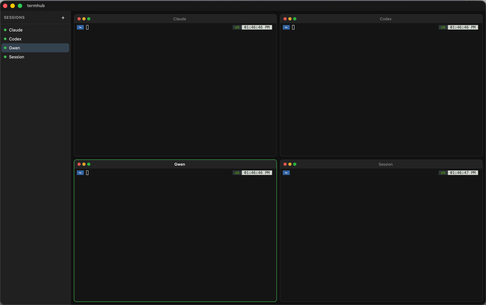

# TermHub

If you run more than a couple of terminal windows at once — especially juggling several AI
coding agents (Claude Code, Codex, etc.) in parallel, one per project — you end up with a mess
of separate OS windows and no single view of what's running where. TermHub puts all of those
sessions in one window instead: every open session renders as a real, independent shell tiled
into an even grid, so you can see and type into several at a glance instead of alt-tabbing
between windows.

It's a cross-platform desktop app (macOS + Windows) built with [Tauri](https://tauri.app)
(Rust backend) + React/TypeScript (frontend). Each session is a real shell process
(zsh/bash/PowerShell/cmd) rendered in-app via [`xterm.js`](https://xtermjs.org), backed by a
real PTY via [`portable-pty`](https://docs.rs/portable-pty) — not a scripted/embedded copy of
iTerm2 or Windows Terminal, which can't be embedded.

Future phases add per-session/per-agent token usage tracking — see
[`terminal-manager-prompt.md`](../terminal-manager-prompt.md) for the full roadmap.



## Features

- **Tiled grid of live terminals** — every running session is shown at once, laid out in an
  even NxM grid (2 sessions → side-by-side, 3–4 → 2×2, 5–6 → 3×2, …) that reflows automatically
  as you open or close sessions, like a tiling window manager. Click into any pane to type — it
  routes to that pane's own shell; the focused pane gets a highlighted border.
- **New / close / rename / switch** between sessions from the sidebar. New sessions drop
  straight into an editable name field so you can name them immediately, instead of a generic
  default label you have to double-click later.
- **PTY resize kept in sync** with each terminal view as panes resize.
- **Session persistence** — name, working directory, and shell are stored in SQLite so sessions
  can be reopened across app restarts (reconnecting the actual process is out of scope for
  MVP — a "closed" session reopens as a fresh shell in the same working directory).
- **Open in an external terminal** — pick your preferred app (iTerm2, Apple Terminal, Warp,
  Alacritty, WezTerm, Hyper, kitty on macOS; Windows Terminal/PowerShell/Command Prompt on
  Windows — auto-detected from what's actually installed) from the sidebar settings dropdown,
  then hit the `⤢` button on any pane to pop that session's folder open in it. This runs
  alongside the built-in terminal, it doesn't replace it.

## Status: Phase 1 (MVP)

## Prerequisites

- [Rust](https://www.rust-lang.org/tools/install) (stable toolchain)
- [Node.js](https://nodejs.org/) 18+
- Tauri platform prerequisites: https://tauri.app/start/prerequisites/

## Development

```sh
npm install
npm run tauri dev
```

## Build

```sh
npm run tauri build
```

## Project layout

- `src/` — React + TypeScript frontend:
  - `components/TerminalView.tsx` — xterm.js instance wired to a session's PTY events.
  - `components/TerminalPane.tsx` — pane chrome (title, close, open-externally) around a
    `TerminalView`.
  - `components/Sidebar.tsx` — session list, rename, new/close/reopen, external-app setting.
  - `lib/api.ts` — typed wrappers around the Tauri commands below.
- `src-tauri/src/` — Rust backend:
  - `pty_manager.rs` — spawns/tracks PTY processes, streams output as Tauri events.
  - `db.rs` — SQLite-backed session registry (`rusqlite`).
  - `external_terminal.rs` — detects installed terminal apps and launches a session's folder
    in one.
  - `commands.rs` — Tauri commands invoked from the frontend.

## License

MIT — see [LICENSE](LICENSE).
# term-hub
